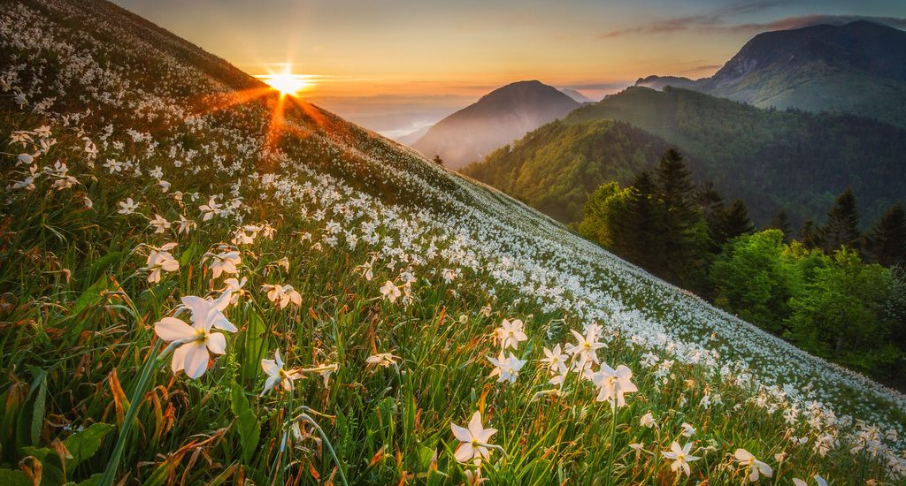

Golica je travnati vrh, koji se nalazi sjeverno od Jesenice. S vrha, pruža se prekrasan pogled na zapadni Karavanke i dio Julijskih Alpa s Triglavom. Najbolje je vrijeme posjetiti Golicu u svibnju, jer na obroncima planina pod Golico cvjetaju narcise (peharčeki). Zbog očuvanja narcisa, nije dopuštano brati ih, već samo gledati i fotografirati. Na taj način ćemo ih očuvati za sljedeće generacije.

##VISINSKA RAZLIKA

850m

##USPON

(oko 2,5 sati + odmor) Od parkirališta u mjestu Planina pod Golico krećemo preko Koče na Golici (1582m) do našeg cilja, vrha Golica (1835m). Vrijeme za odmor i slikanje.

 
##SILAZAK

(2,5 sata + odmor) Od vrha Golice, uz duži odmor kod Koče na Golici, spuštanje do pakirališta autobusa.