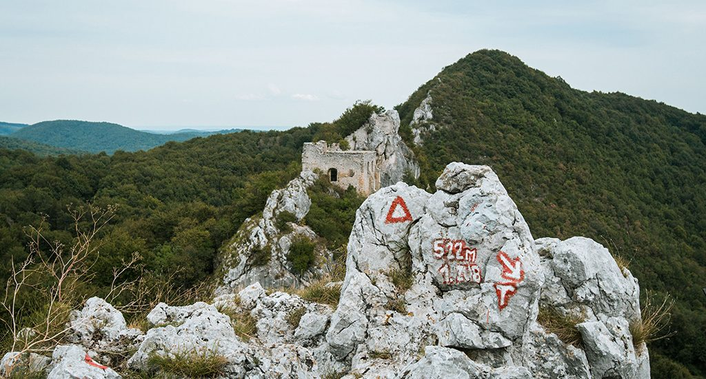

Vranilac je najviši vrh Kalnika (643m). Najviša točka rastrgane stjenovite gromade označena je geodetskim stupom, a malo niže pod vrhom stoji televizijski odašiljač. Od vrha prema sjeveroistoku strši niz stjenovitih zubaca, zvanih popularno Sedam zuba. Gledan izdaleka, Kalnik djeluje kao impozantan zid istegnut u pravcu jugozapad-sjeveroistok. Za razliku od većine drugih planina i brda u Hrvatskom zagorju ili na njegovu rubu, na Kalniku ćemo susresti slikovite okomite stijene. Vranilac je ujedno i najviši vrh Koprivničko-križevačke županije. 

Područje Kalnika naseljeno je već više od 3000 godina. Najstariji poznati nalazi ljudskog prisustva na ovom području pronađeni su na lokalitetu Igrišće, proplanku koji se nalazi ispod najvišeg vrha Vranilca, a potječu još iz brončanog doba. Naselje Kalnik nastalo je u srednjem vijeku, u XIII. stoljeću, kao podgrađe (suburbuium) ispod utvrde Veliki Kalnik, i to vrijeme nosi naziv Brezovica. 

Godine 1367.od kralja Ludovika Anžuvinca Brezovica dobiva status “kraljevskog grada”, koji joj je tijekom XIV. stoljeća nekoliko puta potvrđivan. Pošto je bila izuzeta od vlasti gospodara utvrde Veliki Kalnik, Brezovica je kalničkim jednoselišnim plemićima (iobagiones uni sesionis) služila kao upravno središte. Vrhunac razvoja Brezovica doživljava na prijelazu XV. u XVI. stoljeće, no već u drugoj polovini XVI. st. njena važnost opada zbog sve veće turske opasnosti koja je pogodila čitav podkalnički kraj.

 Kasnije, od XVII. st. pa nadalje, Brezovica, tj. Kalnik, biti će samo jedno od većih naselja u okolici Križevaca.