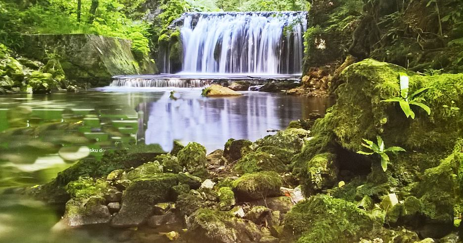

Jedna od najljepših potočnih dolina je dolina Slapnica. Potok je dobio svoje ime po brojnim slapištima i kaskadama niz koje se voda spušta uskom i duboko usječenom dolinom dužine 10 km. U dolini se ljepotom izdvaja Vranjački slap koji je optočen sedrom - "živom" stijenom koja i danas nastaje. Nešto uzvodnije se nalazi slap Brisalo - jedan od najviših slapova našeg Parka niz koji se voda obrušava u malo bistro jezerce. 

## Kako Doci

1. Do krasica
2. Pa pratis
3. Daljnje upute